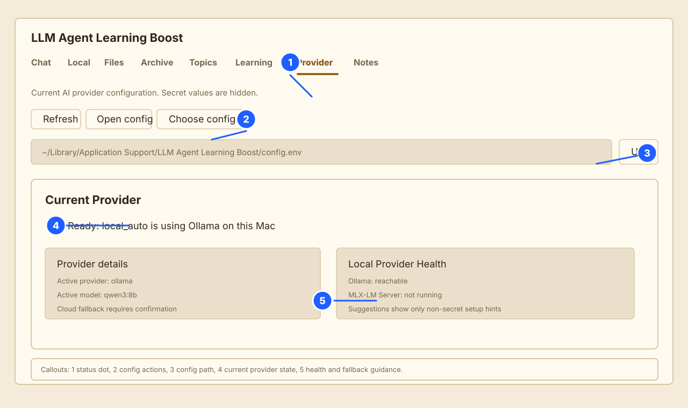
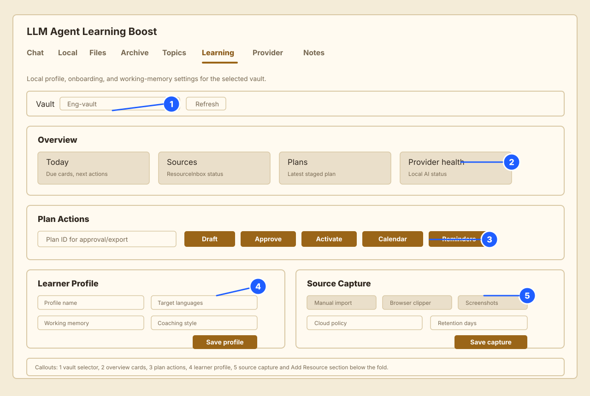

# Provider and Learning Tabs Manual

This manual explains the two tabs that most affect daily use: Provider and Learning. It is written for a learner who wants to know what each control means, what to click next, and how to stay local-first.

## Start Here

Use the Provider tab first. It tells you whether the app has a usable AI provider and whether that provider is local, LAN, or cloud fallback.

If you are connecting to `bilalalissa/Ai-Local-Models-Router`, use [Connect Local AI Router](connect-local-ai-router.md) for automatic localhost setup, ready/waiting status meanings, and manual Provider tab fields.

Use the Learning tab second. It turns your vault sources into next actions, cards, plans, source capture settings, and exports.

Safe default workflow:

1. Open Provider.
2. Confirm the status is green or read the fallback suggestions.
3. Open Learning.
4. Select the vault you want to work with.
5. Read Overview before changing settings.
6. Add one source or draft one plan.
7. Save changes only when the confirmation message matches what you intended.

## Annotated Provider Tab



1. Status dot and Provider tab label: shows whether the active provider is healthy, degraded, or unavailable.
2. Config actions: refresh status, open the config file, or choose a different config file.
3. Config path: the exact config file the app is reading. This is useful when more than one app copy or repo exists.
4. Current provider state: shows the active provider, active model, and whether the app is using local AI or waiting for setup.
5. Local provider health and fallback suggestions: shows which local providers are reachable and what to do next.

## Provider Tab Walkthrough

The Provider tab answers one question: "What AI will the app use if I ask it to process or answer something?"

### Current Provider

Look here first. The important fields are:

- Provider: the configured provider family, usually `local_auto`.
- Active provider: the provider actually selected after health checks.
- Active model: the model name the app will ask.
- Status: a plain-language summary of readiness.
- Status detail: why the app chose that state.

If `Provider` is `local_auto`, the app tries local providers first. If none are available, cloud fallback remains confirmation-gated when configured that way.

### Status Dot

Use this as a quick signal, not as the whole diagnosis.

- Green: provider is usable.
- Orange: provider may work, but setup or fallback attention is needed.
- Red: no usable provider was found or a required provider is unavailable.
- Grey: provider has not been checked yet.

### Local Provider Health

This area lists local options such as Ollama, MLX-LM Server, MLX-LM CLI, and OpenAI-compatible local endpoints.

Common meanings:

- Reachable: the app can contact that provider.
- Not running: the app could not connect to the provider process.
- Blocked or warning: the endpoint is non-local, unauthenticated, or otherwise needs attention.

### Config Actions

Refresh checks provider status again.

Open config opens the active config file in TextEdit. Use this when you need to edit model names, provider order, or fallback settings.

Choose config file lets you point the app to another config file. Use this only when you intentionally keep multiple app configurations.

Use path saves the path typed in the config path field.

### Cloud Fallback

Cloud fallback means the app can use a non-local provider only after confirmation. This matters because local notes and source text can be sensitive.

Recommended setting:

```text
DEFAULT_AI_PROVIDER=local_auto
LOCAL_AI_REQUIRE_CONFIRM_CLOUD_FALLBACK=true
```

Choose cloud fallback only when:

- you understand which content may be sent,
- the source is not sensitive or critical,
- and the confirmation prompt matches your intent.

## Provider Examples

### I Only Want Local AI

Use this if you do not want local vault text sent to cloud services.

1. Open Provider.
2. Confirm `Provider` is `local_auto`.
3. Open config.
4. Keep `LOCAL_AI_REQUIRE_CONFIRM_CLOUD_FALLBACK=true`.
5. Use Ollama, MLX-LM Server, MLX-LM CLI, or a local OpenAI-compatible endpoint.
6. Do not confirm cloud fallback prompts for sensitive work.

Example config:

```text
DEFAULT_AI_PROVIDER=local_auto
LOCAL_AI_PROVIDER_PRIORITY=mlx_lm_server,ollama,mlx_lm_cli,openai_compat
LOCAL_AI_REQUIRE_CONFIRM_CLOUD_FALLBACK=true
```

### Ollama Is Not Running

What you see:

- Provider tab is orange or red.
- Ollama health says not running or connection refused.

What to do:

1. Start Ollama on the Mac.
2. Confirm the configured model exists.
3. Click Refresh in Provider.
4. If the model name is wrong, open config and update `OLLAMA_MODEL`.

Example:

```text
OLLAMA_BASE_URL=http://127.0.0.1:11434
OLLAMA_MODEL=qwen3:8b
```

### I Have A LAN Model Server

Use a LAN endpoint only when you trust the network and understand who can reach the server.

1. Open config.
2. Set the provider endpoint to the LAN URL.
3. Prefer provider authentication if supported.
4. Open Provider and read LAN/privacy warnings.
5. Click Refresh.

Example:

```text
MLX_LM_SERVER_BASE_URL=http://192.168.1.50:8080
```

## Annotated Learning Tab



1. Vault selector: choose which vault's learning profile, plans, resources, and settings you are editing.
2. Overview: read this first. It summarizes next actions, source backlog, plans, reviews, provider health, and profile status.
3. Learning Autopilot: controls automatic source processing, plan drafting, plan-update suggestions, and native macOS notifications.
4. Plan Actions: draft, approve, activate, and export learning plans. Approval does not automatically schedule anything.
5. Learner Profile: personalizes explanations, target languages, session length, and coaching style.
6. Source Capture and Add Resource: controls how new learning material enters the vault.

## Learning Tab Walkthrough

The Learning tab answers one question: "What should I learn next from this vault, and how should the app support me?"

### Vault Selector

Always check the selected vault before saving profile or capture settings. Learning data is vault-specific and is stored under:

```text
.llm-wiki/learning/
```

Changing the selected vault changes the profile, resources, plans, and source capture settings shown below.

### Overview

Overview is the reading area. It is meant to be scanned before you click controls.

Cards you may see include:

- Today: small next actions and due review count.
- Sources to process: resources waiting to become learning material.
- Learning plans: latest plan and stage status.
- Goals: current learning goals.
- Due reviews: cards ready for active recall.
- RemNote export: export status and card count.
- Provider health: whether local AI is available.
- Profile/onboarding: whether profile settings are ready.

Use Overview as your "what now?" area. If it says provider health needs attention, go to Provider before drafting or exporting.

Most Overview, flow, card, source, plan, goal, provider, and notification items are clickable targets. A click should move you to the matching Learning section, Files/Topics row, Provider tab, or plan/goal editor and briefly highlight the destination. If the destination is only a vault file, the app opens that file from the known vault root.

### Learning Autopilot

Learning Autopilot is the normal automatic flow. When it is on, Learning Boost watches `raw/`, `raw/inbox/`, `raw/input/`, and approved captured resources. If the selected provider can answer, the app processes pending sources into source pages, multiple learning bits, active-recall cards, source links, and dashboards. If the provider cannot answer, the file stays pending and the Notification Center records the blocker.

Controls:

- Learning Autopilot: pause or resume background learning work for the selected vault.
- Auto-process new sources: process new raw files and staged ResourceInbox items when safe.
- Auto-draft plans/goals: draft proposed plans from gathered bits, cards, source links, and resources.
- Auto-suggest plan updates: record plan edits that may help, without applying them automatically.
- Native macOS notifications: allow the wrapper to send privacy-safe system alerts.
- Process pending now: run the same safe loop immediately.
- Send test notification: queue one alert and ask macOS to deliver it.

The in-app Notification Center remains the durable alert log. It shows native delivery state such as pending, delivered, blocked by permission, or failed after retry attempts.

macOS delivery and in-app reading are separate. A notification can be delivered by macOS and still remain unread in the app until you choose Mark read or Dismiss. The stack summary shows unread, pending macOS delivery, delivered, and blocked/failed counts.

### Plan Actions

Plan Actions are for turning gathered learning outputs into staged work.

Draft plans creates proposed learning plans from ResourceInbox items plus processed learning bits, cards, and source links. Source-level suggestions guide the draft, but the plan is based on the gathered context, not one isolated source.

Approve plan marks a plan as approved. Approval means "this plan is acceptable." It does not schedule Calendar or Reminders.

Activate plan makes the approved plan the current active plan.

Export calendar creates an iCalendar file only after confirmation.

Export reminders creates a Reminders-ready Markdown export only after confirmation.

Suggest updates looks for changes that may improve a plan. Suggestions are stored; they are not automatically applied.

### Learner Profile

The Learner Profile affects explanation style and learning pacing.

Recommended first edits:

- Profile name: a human-readable name for this profile.
- Target languages: language or languages you are learning.
- Working memory: choose `Friendly` if you want smaller steps.
- Explanation level: choose `Standard` unless you need simpler or more technical explanations.
- Coaching style: choose `Gentle` for supportive prompts or `Minimal` for fewer prompts.
- Session minutes: how long a normal learning session should be.

Privacy controls:

- You can use `prefer_not_to_say` for demographic fields.
- You can disable demographic personalization.
- Profile changes that affect sensitive personalization ask for confirmation.

### Source Capture

Source Capture controls what the app may collect or watch.

Safe default:

- Manual import on.
- Browser clipper on.
- Browser history import off.
- Opened-document detection off.
- Screenshots off.
- Meetings off.
- Voice memos off.
- Cloud policy: ask each time or never.

Full Local Capture Mode is intentionally confirmation-gated. Enable it only if you want broader local activity capture and understand what sources may be indexed locally.

### Add Resource

Use Add Resource when you want to add one item deliberately.

Example for one article:

1. Open Learning.
2. Select the vault.
3. Open Add Resource.
4. Enter the article title.
5. Paste the URL.
6. Add a topic such as `language practice` or `database indexing`.
7. Choose sensitivity.
8. Click Add resource.

Sensitivity guide:

- Auto: let the app infer.
- Public: safe public material.
- Personal: private but not highly sensitive.
- Sensitive: should stay local unless you explicitly decide otherwise.
- Critical: local-only by policy.

## Learning Examples

### I Want To Draft A Learning Plan

1. Add or capture at least one resource.
2. Open Learning.
3. Select the correct vault.
4. Read Overview to confirm resources exist.
5. Click Draft plans.
6. Copy or note the generated Plan ID.
7. Review the plan.
8. Click Approve plan only if it looks right.
9. Click Activate plan when you are ready to work from it.

### I Want Safe Source Capture

Use this if privacy matters and you want deliberate capture.

1. Open Learning.
2. Open Source Capture.
3. Keep Manual import enabled.
4. Keep Browser clipper enabled if you use the extension.
5. Keep browser history, opened documents, screenshots, meetings, and voice memos off.
6. Set Cloud policy to `Never` or `Ask each time`.
7. Click Save capture settings.

### I Want To Add One Article

1. Open Learning.
2. Open Add Resource.
3. Fill Resource title, URL, Topic, and Sensitivity.
4. Use Public for a public article.
5. Use Sensitive if the URL or notes include private information.
6. Click Add resource.
7. Return to Overview and look for the resource in Sources to process.

### I Want To Export To RemNote

1. Open Learning.
2. Select the vault.
3. Read Overview for card count.
4. Click Export RemNote.
5. Confirm if the export is large.
6. Use the generated Markdown/text files and media bundle for manual RemNote import.

## Common Problems

### The Learning tab says local AI is unavailable

Open Provider first. Fix local provider health before drafting plans or processing sources.

### I do not know which plan ID to use

Draft or load plans first. The latest generated plan is usually shown in Overview and in the vault learning pages.

### A confirmation prompt appeared

Stop and read it. Confirmation prompts are used for actions that may broaden capture, send data outside the local machine, schedule external items, or change sensitive profile behavior.

### The app feels too busy

Use the sections in this order:

1. Overview
2. Add Resource
3. Plan Actions
4. Learner Profile
5. Source Capture

Most daily sessions only need Overview and one action.
